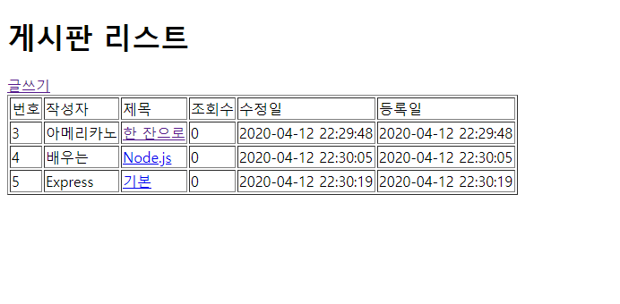
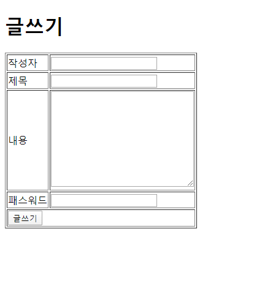
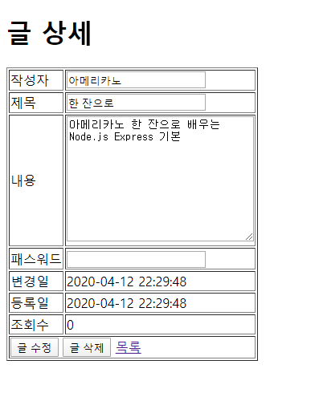

# ☕아메리카노 한 잔으로 배우는 Node.js Express 기본

## [📙ebook 링크](http://book.dkyobobook.co.kr/main.ink)
> 4월 동안 전국민 대상 2권까지 대출 가능!

## 📷스크린샷

게시판 리스트

게시판 글쓰기

게시판 글 상세

## ✒후기
> 원래 4딸라 가격의 ebook이고, 이번에 무료 이벤트가 아니었다면 보지 않았을 책...
>
> 퀄리티는 인터넷에 떠도는 블로그 튜토리얼 수준이다... 이론 없고 개발 환경 설치와 간단한 게시판 만들기가 전부. 그마저도 sql문 쓰는 거 빼면 매우 간단.
> 
> 그냥 입문용으로 잠~깐 체험하는 정도로만 추천.

